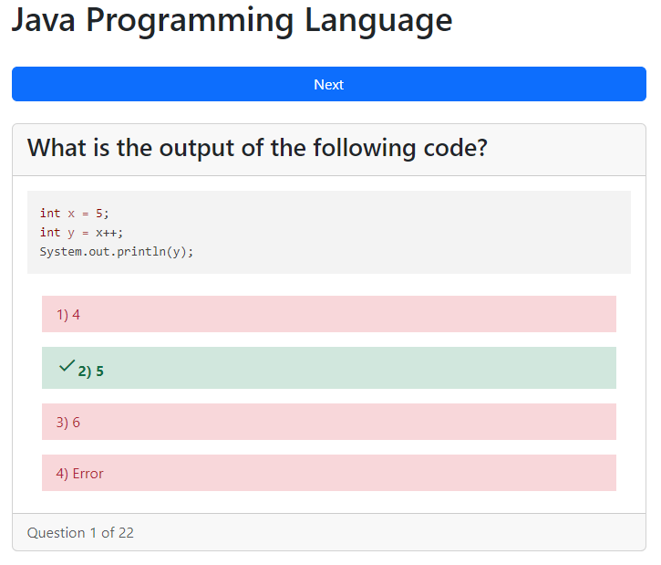
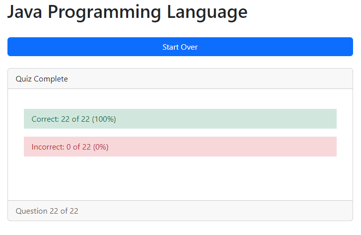

# flash-cards

A simple flash card and quiz app for learning. Written in HTML/JavaScript. Bootstrap for CSS.

# Example Multiple Choice Quiz Card


# Example Quiz Complete


# JSON Schema
The `topic` is used as the Quiz Title. The `language` is used to determine the syntax highlighting for the code block. The `questions` are an array of objects with the `question`, `options`, and `answer`. The `options` are an array of strings. The `answer` is the index of the correct option.

If the `question` contains a code snippet, it will be in the `code` array. The code array is an array of strings. Each string is a line of code. The code will be syntax highlighted using the language specified in the `language` field.

```json
{
    "topic": "Python Programming Language",
    "language": "language-python",
    "questions": [
    {
      "question": "Which statement is true about lists and tuples in Python?",
      "options": [
        "Tuples are immutable and lists are mutable",
        "Tuples are mutable and lists are immutable",
        "Tuples are slower than lists",
        "Tuples consume more memory than lists"
      ],
      "answer": 0
    },
    {
      "question": "What is the output of the following Python code: ?",
      "code": ["print('hello' * 3)"],
      "options": ["hello", "hellohellohello", "hello hello hello", "3hello"],
      "answer": 1
    }
  ]
}
```
